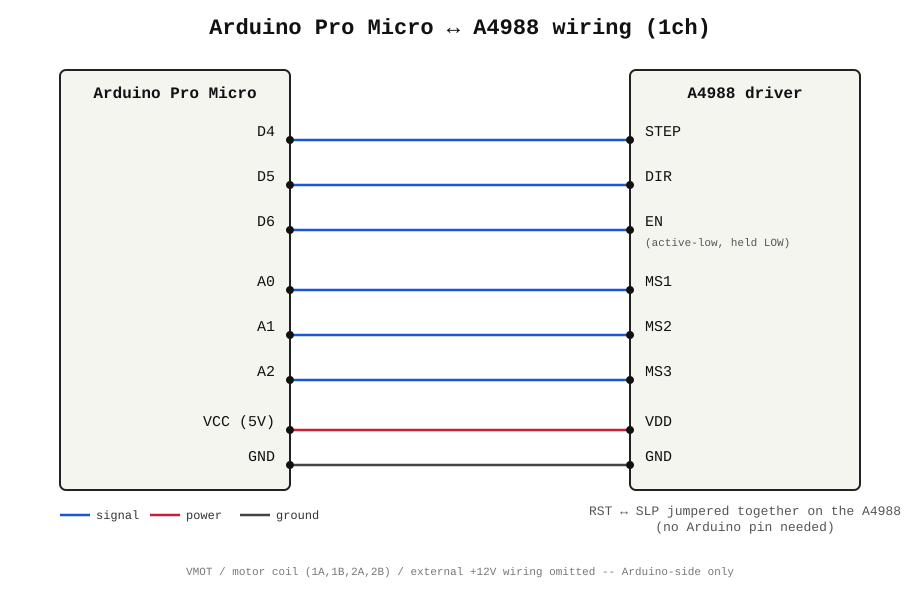
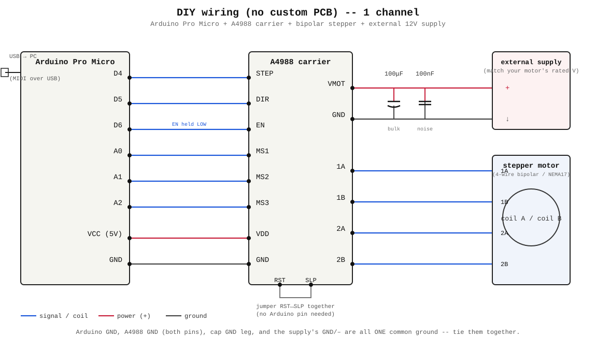

# ステッピングモータでMIDIを再生できるやつ

stepping-motor-midi-player

USB MIDIで受け取った音を、ステッピングモーターに実際に鳴かせて音にするMIDIシンセサイザー。

**Languages:** [日本語](#日本語) | [English](#english) | [中文](#中文) | [한국어](#한국어)

---

## 日本語

### これは何?

STEPピンをMIDIノートの音程とぴったり同じ周波数でパカパカ切り替えると、ステッピングモーターがその音程で鳴いてくれる(singing stepperってやつ)。この現象を使って、A4988ドライバ+モーター1組を1音分の音源として、DAWやシーケンサーからMIDIで弾けるようにしたもの。各チャンネルにArduinoを1枚使うので、マスター機とかは無し。全部のArduinoが個別にUSB MIDI機器として認識される。

### 中身

- **`firmware/`** — Arduino(Pro Micro互換ボード)に書き込むスケッチ。
  - `stp_motr_channel_velocity/` → こっちが最終版。音程だけじゃなくベロシティ(強弱)もマイクロステップの粗さで表現できる。
  - `stp_motr_channel/` → ベロシティは見てない、シンプルな方。
  - 全チャンネル、同じスケッチを書き込むだけでOK。
- **`hardware/`** — 本番基板(2ch、100×50mm)関連を全部入れてある。
  - **`stp-motr-2ch-100x50-gerbers.zip`** → 製造用データ一式。KiCadすら開かずに、これをJLCPCBとかにそのままアップロードすれば発注できる。
  - `gerbers/` → 上のZIPを展開したやつ。個別に見たい時用。
  - `stp-motr-2ch-100x50.kicad_pro` / `.kicad_sch` / `.kicad_pcb` → 編集・確認したい人向けのKiCadデータ。自作フットプリント/シンボルも `stp_motr.pretty/` `stp_motr.kicad_sym` に同封してるので、これだけで開ける。
  - **`BOM.csv`** → 部品リスト。
  - **`digikey_order.csv`** → Digikeyにそのままインポートできる注文リスト。

### Arduino⇔A4988の配線

1チャンネル分の結線はこんな感じ。他のチャンネルも同じ。

- D4→STEP、D5→DIR、D6→EN(常時LOWでドライバON)
- A0→MS1、A1→MS2、A2→MS3(マイクロステップの切り替え)
- VCC→VDD、GND→GND
- A4988側のRSTとSLPは自分同士でジャンパーするだけ、Arduino側のピンは要らない
- VMOT・コイル出力(1A/1B/2A/2B)・外部+12Vは図から省略(モーター/電源側の配線なので)

### 専用基板を使わず自分で組む場合

基板を起こさずブレッドボードとかで直結したい人向けに、電源・コンデンサ・モーターまで全部含めた回路図も置いてある。

- Arduino側のピンは上と同じ(D4/D5/D6/A0/A1/A2/VCC/GND)
- VMOT-GND間に100&micro;F(低周波の電流供給用)と100nF(PWMノイズ吸収用)を並列で入れる — これが無いとモーターがガキゴカ鳴りやすい
- 外部電源は使うモーターの定格電圧に合わせる(12V用モーターなら12V)
- A4988の1A/1B/2A/2Bをモーターの4本のコイル線に(どっちが1A/1Bかは実際に回してみて逆なら入れ替えればOK)
- Arduino GND・A4988のGND(2本とも)・コンデンサのGND足・外部電源のGND(-)は全部同じ1本のグラウンドとしてつなぐ

### 用意するもの

- Arduino Pro Micro互換ボード(ATmega32U4, 5V/16MHz)をチャンネル数分
- Pololu A4988(ヒートシンク付きがおすすめ)をチャンネル数分
- NEMA17クラスのステッピングモーターをチャンネル数分
- 細かい部品は `hardware/BOM.csv` 見てください

### 基板の発注

1. `hardware/stp-motr-2ch-100x50-gerbers.zip` をダウンロード
2. JLCPCBとかPCBWayにそのままアップロード
3. 枚数と色選んで注文するだけ

### 部品の発注

- 全部 `hardware/BOM.csv` に書いてある
- Digikeyで買うなら `hardware/digikey_order.csv` をBOM Managerに突っ込むだけ

### ライセンス

MIT License。`LICENSE` 見てください。

---

## English

### What is this?

If you toggle an A4988's STEP pin at exactly the frequency of a MIDI note's pitch, the stepper motor it's driving will "sing" that pitch — people call this the "singing stepper" trick. This project turns one motor + A4988 pair into a single-voice synth channel, playable live from a DAW or sequencer over USB MIDI. One Arduino per channel, no master board — each one just shows up as its own USB MIDI device.

### What's in here

- **`firmware/`** — sketches for Pro Micro-compatible Arduinos.
  - `stp_motr_channel_velocity/` — the final one. Covers velocity too, not just pitch, by varying how coarse the microstepping is.
  - `stp_motr_channel/` — simpler, pitch-only version.
  - Just flash the same sketch to every channel's board, that's it.
- **`hardware/`** — everything for the actual board (2-channel, 100×50mm).
  - **`stp-motr-2ch-100x50-gerbers.zip`** — the manufacturing files. Upload this straight to JLCPCB or wherever, no need to even open KiCad.
  - `gerbers/` — same thing, already unzipped, if you want to poke at individual files.
  - `stp-motr-2ch-100x50.kicad_pro` / `.kicad_sch` / `.kicad_pcb` — the actual KiCad files if you want to look around or make changes. The custom footprints/symbols are bundled in `stp_motr.pretty/` and `stp_motr.kicad_sym` so it just opens.
  - **`BOM.csv`** — the parts list.
  - **`digikey_order.csv`** — drop this straight into Digikey's order tool.

### Arduino⇔A4988 wiring

Here's how one channel's wiring looks. Every other channel is identical.

- D4→STEP, D5→DIR, D6→EN (held LOW all the time to keep the driver on)
- A0→MS1, A1→MS2, A2→MS3 (microstep selection)
- VCC→VDD, GND→GND
- RST and SLP just jumper to each other on the A4988 — no Arduino pin needed
- VMOT, the coil outputs (1A/1B/2A/2B), and the external +12V are left out of the diagram since that's motor/power wiring, not Arduino wiring

### Building it without the custom board

If you'd rather wire this up on a breadboard or protoboard instead of ordering the PCB, here's the full circuit — power supply, decoupling caps, and motor included.

- Arduino pins are the same as above (D4/D5/D6/A0/A1/A2/VCC/GND)
- Put a 100&micro;F (bulk current) and a 100nF (PWM noise) cap in parallel across VMOT-GND — skip these and the motor tends to buzz
- Match the external supply voltage to your motor's rating (12V motor → 12V supply)
- Wire A4988's 1A/1B/2A/2B to the motor's 4 coil leads (if it spins the wrong way or sounds off, just swap a pair)
- Arduino GND, both A4988 GND pins, the cap's ground leg, and the supply's GND/– all need to be the same single ground net

### What you'll need

- One Arduino Pro Micro-compatible board (ATmega32U4, 5V/16MHz) per channel
- One Pololu A4988 (heatsink recommended) per channel
- One NEMA17-class stepper per channel
- Everything else is in `hardware/BOM.csv`

### Ordering the board

1. Grab `hardware/stp-motr-2ch-100x50-gerbers.zip`
2. Upload it to JLCPCB, PCBWay, whatever you use
3. Pick a quantity/color and you're done

### Ordering parts

- It's all in `hardware/BOM.csv`
- Digikey people: just import `hardware/digikey_order.csv` into their BOM Manager

### License

MIT — see `LICENSE`.

---

## 中文

### 这是啥

如果让A4988的STEP引脚正好按某个MIDI音高对应的频率来回切换,它驱动的步进电机就会跟着"唱"出那个音高——大家管这叫"会唱歌的步进电机"。这个项目就是靠这招,把一个电机+A4988凑成一路单音音源,接上USB MIDI就能直接用DAW或音序器弹。每个声部一块Arduino,没有主控这种东西,每块板子自己就是一个独立的USB MIDI设备。

### 里面都有什么

- **`firmware/`** — 刷到Pro Micro兼容板上的程序。
  - `stp_motr_channel_velocity/` — 这是最终版,不只管音高,力度也靠微步细不细来表现。
  - `stp_motr_channel/` — 简化版,没管力度。
  - 每个声部的板子刷同一份程序就行。
- **`hardware/`** — 实际用的那块板子(2通道、100×50mm)的所有东西。
  - **`stp-motr-2ch-100x50-gerbers.zip`** — 生产用的文件,直接传到JLCPCB之类的厂家就能下单,KiCad都不用打开。
  - `gerbers/` — 同样的东西,解压好了,想单独看哪个文件就去这里。
  - `stp-motr-2ch-100x50.kicad_pro` / `.kicad_sch` / `.kicad_pcb` — 想看看电路或者改改的话,这是KiCad源文件。自定义的封装/符号都打包在 `stp_motr.pretty/` 和 `stp_motr.kicad_sym` 里了,打开就能用。
  - **`BOM.csv`** — 物料清单。
  - **`digikey_order.csv`** — 直接丢进Digikey的下单工具就行。

### Arduino与A4988的接线

一个声部的接线大概就是这样,其他声部都一样。

- D4→STEP,D5→DIR,D6→EN(一直拉LOW让驱动器保持开启)
- A0→MS1,A1→MS2,A2→MS3(切换微步模式)
- VCC→VDD,GND→GND
- A4988上的RST和SLP自己接在一起就行,不用占Arduino的引脚
- VMOT、线圈输出(1A/1B/2A/2B)、外部+12V这些电机/电源侧的接线图里没画

### 不用专用板,自己动手接

想用面包板之类的东西直接接线、不打板的话,这里有张包含电源、滤波电容、电机的完整电路图。

- Arduino这边的引脚跟上面一样(D4/D5/D6/A0/A1/A2/VCC/GND)
- VMOT-GND之间并联一个100&micro;F(供大电流用)和一个100nF(吸收PWM噪声用)——不加这俩电机容易嗡嗡响
- 外部电源电压要跟电机的额定电压匹配(12V电机就配12V电源)
- 把A4988的1A/1B/2A/2B接到电机的4根线圈引线上(转反了或者声音不对就随便换一对线试试)
- Arduino的GND、A4988的两个GND引脚、电容的接地脚、电源的GND/-,这些都得接成同一个地

### 得准备点啥

- 每个声部一块Arduino Pro Micro兼容板(ATmega32U4,5V/16MHz)
- 每个声部一块Pololu A4988(建议带散热片)
- 每个声部一台NEMA17级步进电机
- 剩下的零件都列在 `hardware/BOM.csv` 里了

### 怎么下单做板子

1. 下载 `hardware/stp-motr-2ch-100x50-gerbers.zip`
2. 传到JLCPCB、PCBWay随便哪家
3. 选数量选颜色,完事

### 怎么买零件

- 都写在 `hardware/BOM.csv` 里
- 用Digikey的话,把 `hardware/digikey_order.csv` 直接导进它的BOM Manager就行

### 许可证

MIT,详见 `LICENSE`。

---

## 한국어

### 이게 뭐냐면

A4988의 STEP 핀을 MIDI 노트 음높이랑 정확히 같은 주파수로 토글해주면, 그 모터가 그 음으로 "노래"를 부른다. 다들 "노래하는 스테퍼"라고 부르는 그 트릭이다. 이걸로 모터+A4988 한 쌍을 음 하나짜리 채널로 만들어서, USB MIDI로 DAW나 시퀀서에서 바로 연주할 수 있게 한 거다. 채널마다 Arduino 한 장씩, 마스터 보드 같은 건 없고 각자 독립된 USB MIDI 장치로 인식된다.

### 들어있는 것

- **`firmware/`** — Pro Micro 호환 보드에 올리는 스케치.
  - `stp_motr_channel_velocity/` — 이게 최종판. 음높이뿐 아니라 벨로시티도 마이크로스텝 거칠기로 표현한다.
  - `stp_motr_channel/` — 벨로시티는 안 보는 단순 버전.
  - 모든 채널 보드에 같은 스케치 올리면 끝.
- **`hardware/`** — 실제 쓰는 보드(2채널, 100×50mm) 관련 전부.
  - **`stp-motr-2ch-100x50-gerbers.zip`** — 제작용 파일 묶음. KiCad 켤 필요도 없이 이걸 JLCPCB 같은 데 바로 올리면 주문된다.
  - `gerbers/` — 같은 걸 풀어놓은 것. 개별 파일 보고 싶을 때.
  - `stp-motr-2ch-100x50.kicad_pro` / `.kicad_sch` / `.kicad_pcb` — 회로 들여다보거나 고치고 싶으면 이 KiCad 파일들. 커스텀 풋프린트/심볼도 `stp_motr.pretty/`랑 `stp_motr.kicad_sym`에 같이 들어있어서 그냥 열면 된다.
  - **`BOM.csv`** — 부품 목록.
  - **`digikey_order.csv`** — Digikey BOM Manager에 그냥 넣으면 되는 주문 리스트.

### Arduino&#8596;A4988 배선

채널 하나의 배선은 이렇게 생겼다. 다른 채널도 다 똑같다.

- D4→STEP, D5→DIR, D6→EN (드라이버를 계속 켜두려고 항상 LOW)
- A0→MS1, A1→MS2, A2→MS3 (마이크로스텝 모드 선택)
- VCC→VDD, GND→GND
- A4988의 RST랑 SLP는 서로 점퍼만 해주면 됨, Arduino 핀은 필요 없음
- VMOT, 코일 출력(1A/1B/2A/2B), 외부 +12V는 모터/전원 쪽 배선이라 그림에서는 뺐음

### 전용 보드 없이 직접 조립하는 경우

PCB 주문 대신 브레드보드 같은 데 직접 배선하고 싶다면, 전원이랑 디커플링 커패시터, 모터까지 다 포함한 전체 회로도도 준비해놨다.

- Arduino 핀은 위랑 똑같음(D4/D5/D6/A0/A1/A2/VCC/GND)
- VMOT-GND 사이에 100&micro;F(대전류용)랑 100nF(PWM 노이즈 제거용) 커패시터를 병렬로 — 이거 없으면 모터가 윙윙거리기 쉬움
- 외부 전원은 쓰는 모터 정격 전압에 맞추기(12V 모터면 12V 전원)
- A4988의 1A/1B/2A/2B를 모터 코일선 4개에 연결(방향이 반대거나 소리가 이상하면 한 쌍만 바꿔 끼워보면 됨)
- Arduino GND, A4988의 GND 두 개, 커패시터 접지 다리, 전원의 GND/- 는 전부 같은 그라운드 하나로 묶어야 함

### 필요한 것

- 채널당 Arduino Pro Micro 호환 보드(ATmega32U4, 5V/16MHz) 1개
- 채널당 Pololu A4988(방열판 추천) 1개
- 채널당 NEMA17급 스테핑 모터 1개
- 나머지는 `hardware/BOM.csv`에 다 있음

### 보드 주문하기

1. `hardware/stp-motr-2ch-100x50-gerbers.zip` 다운로드
2. JLCPCB든 PCBWay든 그대로 업로드
3. 수량/색상 고르고 끝

### 부품 주문하기

- `hardware/BOM.csv`에 다 적혀있음
- Digikey 쓴다면 `hardware/digikey_order.csv`를 BOM Manager에 그대로 넣으면 됨

### 라이선스

MIT. `LICENSE` 참고.
